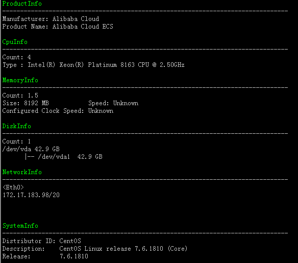
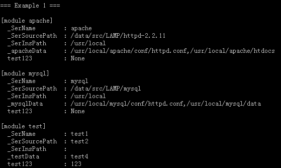
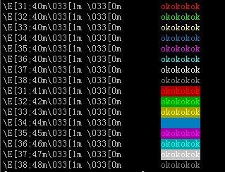

### 多年前写的几个Shell脚本工具，分享给大家，希望对初学Shell脚本编程的同学有所帮助。
1. chkServer.sh： 搜集服务器厂商、CPU、内存、磁盘、网络、操作系统信息并格式化后输出出来  

2. configParser.sh：用shell函数实现的配置文件解析ConfigParser  

3. printColors.sh：打印输出各种颜色，命令行输出可以使用  

